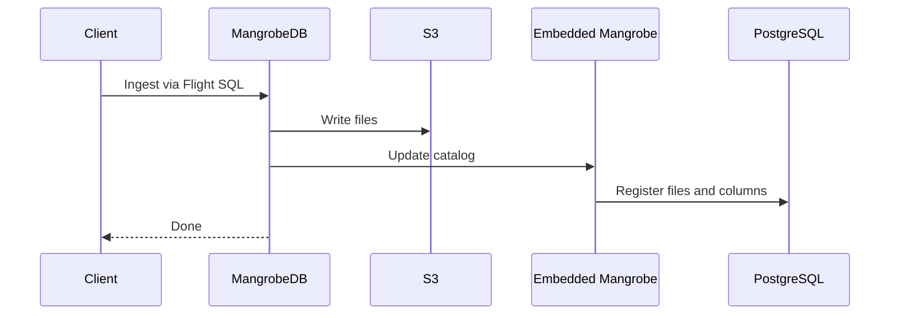
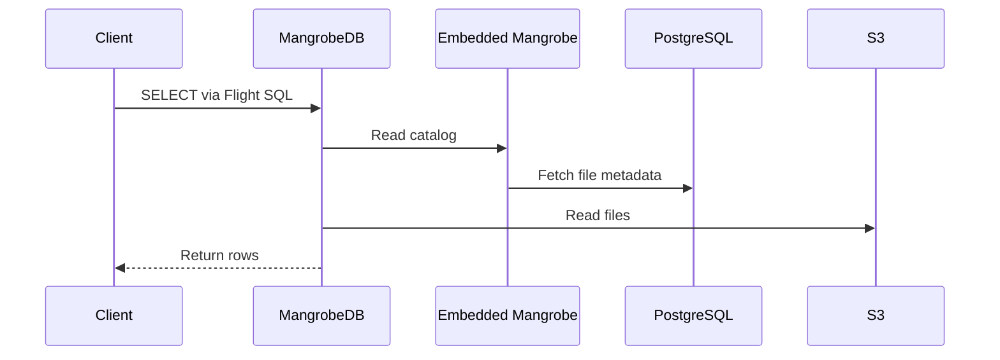

# MangrobeDB

Schemaless OLAPDB for AI and streaming workloads

## Features

* Fast
   * 1000+ QPS streaming ingestion
* Cost-efficient
   * S3-compatible object storage as the primary data layer
* Low maintenance
   * No Hadoop dependency; runs on ECS and S3
   * No schema definition required before ingestion

## Flow

MangrobeDB uses [Arrow Flight SQL](https://arrow.apache.org/docs/format/FlightSql.html) for client communication. Internally, it uses [Mangrobe](https://github.com/mrasu/mangrobe), which stores catalog metadata in PostgreSQL.

### Ingest



### Query



## Run

1. Start Docker Compose:
   ```bash
   docker compose up
   ```
2. Start MangrobeDB:
   ```bash
   just run
   ```
3. In another terminal, run query:
   ```bash
   # Create table: CREATE EXTERNAL TABLE hello_table
   just client-create-table
   
   # Import dummy data
   just client-import
   
   # Run query: select * from hello_table
   just client-query
   ```

## ADBC

You can also connect with an [ADBC](https://arrow.apache.org/adbc/) driver through Arrow Flight SQL.

```python
# pip install adbc-driver-flightsql

from adbc_driver_flightsql.dbapi import connect

conn = connect("grpc://127.0.0.1:50051")

result = conn.execute("select * from hello_table where id > 3")
table = result.fetch_arrow_table()
print(table.to_pandas())
```